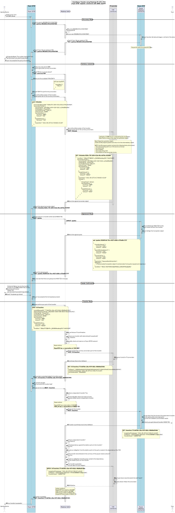
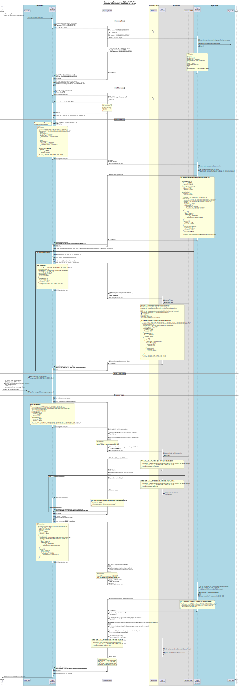
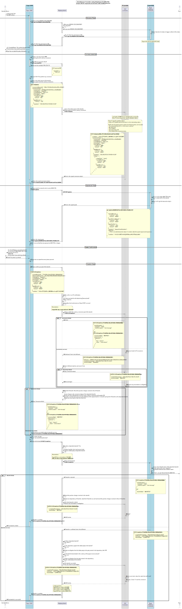

# Currency Conversion - Implementation Design

The Mojaloop currency conversion functional implementation includes support for Payer DFSP currency conversion. In this scenario, it is the Payer DFSP that comes to an agreement with the foreign exchange provider, to provide another currency liquidity in order to fund the transfer.
There are two variation of the implementation. 
 - Sending funds from a local currency
 - Making a payment in a foreign currency

The difference between these use case concerns the amount Type that is specified when making the transfer.

## Sending funds to an account in another currency
For this use case, the Payer DFSP will specify the transfer with amount type **SEND** and define the transfer amount in the **Payer's local currency** (the source currency).
An secondary use case example for this is a P2P remittance transfer.

### Simplified Send Money Diagram
Below is a simplified sequence diagram showing the flows between the Participant organizations, the foreign exchange providers and the Mojaloop switch.

### Detailed Send Money Diagram

Below is a detailed sequence diagram that shows the complete flow, and includes the **Mojaloop Connector** and integration APIs for all participant organizations. (This is a useful view if you are building integrations as a participant organization.)

## Making a payment in another currency
For this use case, the Payer DFSP will specify the transfer with amount type **RECEIVE** and define the transfer amount in the **Payee's local currency** (the target currency).
An secondary use case example for this is a cross boarder Merchant Payment.

Below is a detailed sequence diagram that shows the complete flow, and includes the Mojaloop connector and integration APIs for all participant organizations.

## Abort flows
This sequence diagram show how the design implements abort messages.

## Open API References
These Open API references are designed to be readable for both software an review person. The show the detailed requirements and implementations of the API design.

- [FSPIOP specification Open Api definition](https://github.com/mojaloop/mojaloop-specification/blob/master/fspiop-api/documents/v2.0-document-set/fspiop-v2.0-openapi3-implementation-draft.yaml).
- [API Snippets Open Api definition](https://github.com/mojaloop/api-snippets/blob/main/docs/fspiop-rest-v2.0-openapi3-snippets.yaml)
- [Mojaloop Connector backend Open Api definition](https://github.com/mojaloop/api-snippets/blob/main/docs/sdk-scheme-adapter-backend-v2_1_0-openapi3-snippets.yaml)
- [Mojaloop Connector outbound Open Api definition](https://github.com/mojaloop/api-snippets/blob/main/docs/sdk-scheme-adapter-outbound-v2_1_0-openapi3-snippets.yaml)

